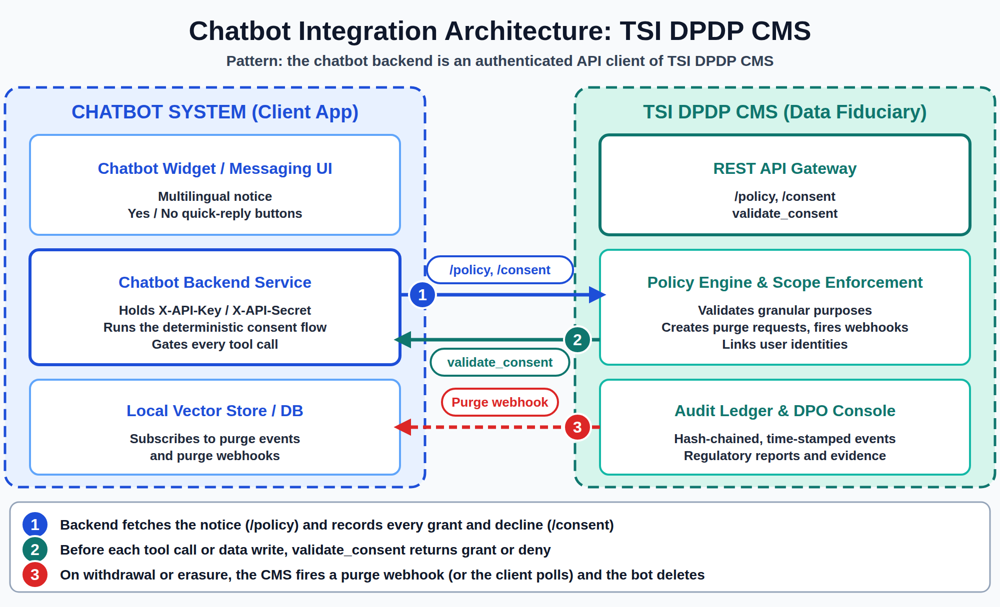
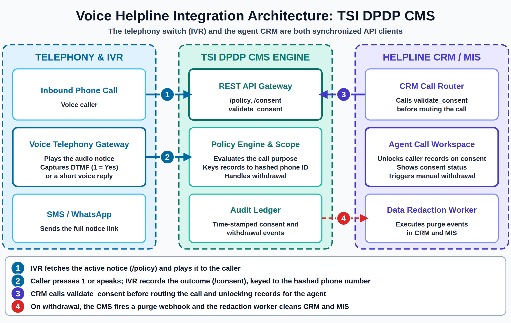

# Chatbot and Voice Helpline Integration Guide

**Document Version:** 1.0
**Audience:** Developers integrating conversational channels (AI chatbots, IVR/telephony switches, helpline CRMs) with TSI DPDP CMS over its REST API.

---

## 1. Overview

This guide describes the integration patterns and implementation rules for connecting client applications, such as chatbots and voice telephony (IVR/helpline) switches, to TSI DPDP CMS over secure REST APIs.

In both patterns the CMS is the system of record for consent. The client never keeps its own copy of consent state; it asks the CMS before processing data, and records every answer (grant or decline) there.

It doesn't cover endpoint-level request and response detail, authentication, or permission scopes - see the [System Integration Guide](system-integration-guide.md) and the [OpenAPI spec](../api/openapi.yaml). For consuming purge and notification events, see the [Webhook Integration Guide](webhook-integration-guide.md) and the [Client Polling Integration Guide](polling-integration-guide.md).

## 2. Chatbot Integration

The chatbot backend acts as an authenticated client application to TSI DPDP CMS (using an App's `X-API-Key` / `X-API-Secret`, held on the backend only, never in the chat widget). The chatbot never stores consent locally; it queries the CMS before processing data or executing tools.

### 2.1 Conversational Lifecycle

1. **Session start:** the backend calls `/policy` `get_active_policy`, passing `fiduciary_id`. The chatbot presents the multilingual notice, or a short summary with a link to the full notice.
2. **Consent turn:** the chatbot prompts per purpose (for example, "Can we save your contact details?"). Quick-reply buttons (Yes/No) are used instead of free text, so each answer is unambiguous.
3. **Record consent:** the backend posts to `/consent` `record_consent` with `user_id`, `policy_id`, `language_selected`, `consent_mechanism` (for example, `chatbot`), and `data_point_consents[]`. Record declines as well as grants.
4. **Gate processing:** before storing data or triggering an action, the backend calls `validate_consent` with the `user_id` and the `required_purpose_id` for that action.
5. **Withdrawal:** when the backend detects an intent such as "Delete my data", it calls `withdraw_consent` or `erasure_request`.
6. **Downstream cleanup:** local vector stores and message logs subscribe to the CMS purge webhooks (or poll the purge list) to remove the user's data, then confirm fulfillment back to the CMS.

### 2.2 Implementation Rules and LLM Guardrails

- **Deterministic execution:** do not let an LLM paraphrase policy notices or infer consent. Consent steps must be handled deterministically in backend code, with explicit UI buttons. The recorded consent has to match the published policy version.
- **Gated tool calls:** wrap backend tools (for example, `save_contact`, `create_ticket`) so each one makes an inline `validate_consent` call before running. If the call is denied, skip the step and continue the conversation without it.
- **External LLM purpose listing:** transmitting data to a third-party LLM provider is a distinct processing purpose. Declare it explicitly in your RoPA and notice.
- **Consistent identity:** use the same stable `user_id` across the chatbot and any other channel (see section 3.2), otherwise a withdrawal in one channel cannot find the record created in another.

## 3. Voice Telephony and Helpline Integration

For phone-based helplines, both the telephony switch (IVR gateway) and the agent CRM act as synchronized API clients to TSI DPDP CMS.

### 3.1 Voice Call Lifecycle

1. **Call greeting:** the IVR fetches the active notice via `/policy` and plays a short (about 15 seconds) regional-language audio notice to the caller. Optionally, an SMS or WhatsApp message with a link to the full policy is sent in parallel.
2. **DTMF / audio consent capture:** the caller presses a key (for example, "Press 1 to agree") or speaks a short acknowledgment. The IVR translates the outcome into a `record_consent` call to `/consent`, with a `consent_mechanism` that identifies the channel (for example, `ivr_dtmf`).
3. **Gated CRM screen:** before routing the call to a live agent, the CRM calls `validate_consent` with the caller's `user_id` (the phone hash) and the `required_purpose_id` for the service (for example, `HELPLINE_COUNSELING`). A granted result unlocks the caller's records on the agent's screen.
4. **Voice withdrawal and purge:** callers can revoke consent through an IVR menu option, or by telling the live agent. The agent portal calls `withdraw_consent`, which creates purge requests and fires purge webhooks to clean up the CRM and MIS databases.

### 3.2 Implementation Rules and Voice Guardrails

- **Unified identity:** use a deterministic hash of the caller's phone number as the primary `user_id` across the IVR switch, TSI DPDP CMS, and the helpline CRM/MIS. Use a keyed hash (such as HMAC-SHA256 with a secret held by your backend) rather than a plain hash, since phone numbers are easy to enumerate.
- **Gated agent access:** ensure agents cannot view historical caller records unless a valid consent is active for that specific counseling purpose. This is enforced in your CRM, by calling `validate_consent` before rendering records.
- **Voice proof:** store audio consent recordings as cryptographically hashed, time-stamped blobs in your own storage, and keep the hash and reference alongside the consent record so the audio can be matched to the CMS audit trail.

> **Note:** the CMS `record_consent` call does not accept or store audio. The audio blob and its hash live in the integrator's storage, and the CMS holds the structured consent record and audit trail. The CMS audit ledger can be crystallised into court-admissible evidence through the Legal module, but audio is not part of that package unless your integration records the audio hash in a field you control.

## 4. Choosing Between Webhooks and Polling

Purge and notification events can be consumed by webhook (push, best-effort, single attempt) or by polling (pull, reliable). For both channels above, use webhooks for low-latency cleanup and run a periodic poll as the reconciliation path for anything a missed delivery would drop. See the [Webhook Integration Guide](webhook-integration-guide.md) and the [Client Polling Integration Guide](polling-integration-guide.md).
